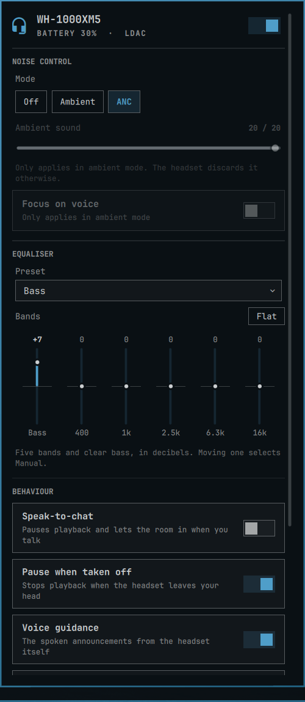
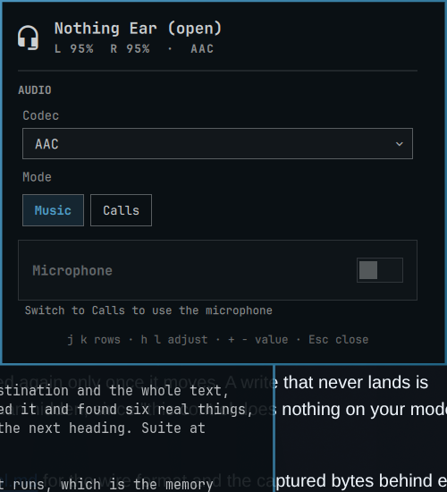
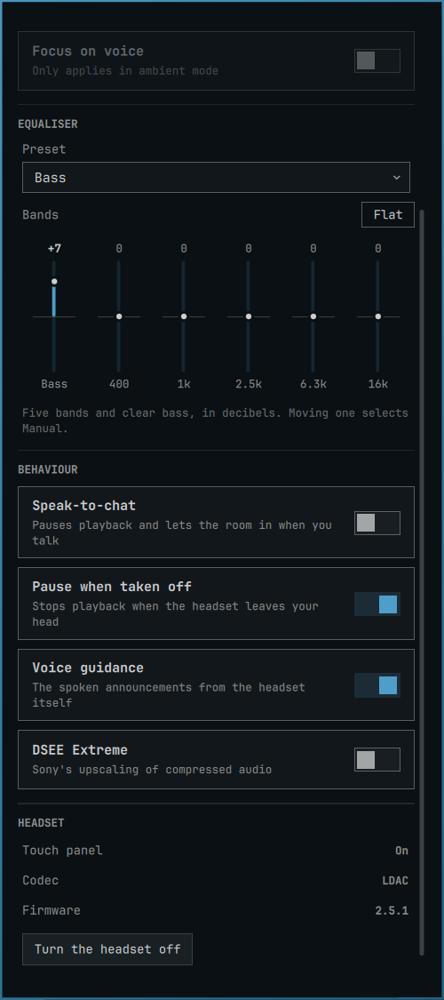

# Headset for Omarchy

Control a Bluetooth headset from the [Omarchy](https://omarchy.org/) bar: noise
cancelling, equaliser, battery, codec and the headset's own behaviour settings.

No vendor app, no daemon, no root, no udev rule.



## What you get

Bluetooth standardises the audio, not the headset, so the panel is built in
three tiers and takes the best one your headset offers.

| | What you get | Where it comes from |
| --- | --- | --- |
| **Every headset** | Battery, the codec in use and the choice of codec, music-or-calls mode, microphone, a ten-band equaliser | BlueZ and PipeWire |
| **Fast Pair** | Battery per earbud and per case, noise control where the headset has it | Google's Message Stream, which unrelated manufacturers implement |
| **Vendor driver** | Ambient sound, the headset's own equaliser, speak-to-chat, pause on removal, voice guidance, DSEE, power off | The manufacturer's own protocol |

One vendor driver ships, Sony MDR over RFCOMM. Every byte of it was read off a
WH-1000XM5.

Fast Pair is a plain RFCOMM service on a fixed UUID. A WH-1000XM5 and a Nothing
Ear (open) both advertise it. As far as I can establish, this is the first open
implementation of its noise-control extension on Linux.

## The equaliser

A headset with no vendor protocol has no equaliser this machine can reach. It
gets one here instead, as a PipeWire filter chain the audio passes through on the
way out.

Ten bands an octave apart, 32 Hz to 16 kHz, plus or minus 10 dB in half-decibel
steps. Five curves to start from: Flat, Bass, Vocal, Treble, Podcast. Moving a
band shows Custom. A trim at the end takes back whatever the bands boost, so the
chain cannot clip.

It is offered only where the headset has no equaliser of its own. The curve is
remembered per headset. The chain is a short-lived PipeWire client configured
from a private directory under `$XDG_RUNTIME_DIR`; none of your own PipeWire
configuration is read or written.

## Compatibility

- Omarchy with its Quickshell bar, tested on **4.0.3-1**.
- Python 3 and BlueZ. Standard library only: nothing to compile, no packages to
  add, no D-Bus bindings.
- PipeWire, for the codec and profile rows. The equaliser additionally needs its
  filter-chain module at `/usr/share/pipewire/filter-chain.conf`, part of the
  stock `pipewire` package on Arch. Without it the equaliser is not offered.
- **Any** Bluetooth headset, for the first tier. Battery needs the headset to
  report it over the hands-free profile, which most do and the cheapest do not.
- Sony headsets speaking the **v2** MDR protocol, for the driver tier:

| Model | Basis |
| --- | --- |
| **WH-1000XM5** | Verified on hardware, firmware 2.5.1. Every table here came off it. |
| WF-1000XM4, WF-1000XM5, LinkBuds, LinkBuds S | v2 by their handshake replies in Gadgetbridge's captured list |
| WH-1000XM6, WH-CH720N | v2 per `gabamnml/omarchy-sony-headphones`, which refuses them for that reason |

The **WH-1000XM4, XM3 and XM2 are not claimed**. They speak v1, which this driver
does not implement. The letter matters: the WF-1000XM4 is v2 and the WH-1000XM4
is not.

Everything but the XM5 is unverified by me. The panel is built from what the
headset answers, not from a table, so an unverified model shows the rows it
actually supports. Reports welcome either way.

This is a Nothing Ear (open), which has no vendor driver here at all:



## Install

```sh
omarchy plugin add https://github.com/itsgg/omarchy-headset.git --enable
```

The widget appears in the bar's right section when a headset is connected, and
disappears when it is not.

## Controls


| Where | Action | Result |
| --- | --- | --- |
| Bar | Left click | Open or close the panel |
| Bar | Middle click | Noise cancelling on or off |
| Bar | Right click | Ambient sound on or off |
| Bar | Scroll | Ambient level, while in ambient mode |
| Panel | `a` / `t` | Noise cancelling / ambient |
| Panel | `j` `k` | Move between rows |
| Panel | `h` `l` | Adjust the row, or pick a band on the equaliser |
| Panel | `+` `-` | Change the value, including one equaliser band |
| Panel | Scroll | Change a band, on either equaliser |
| Panel | `r` / `Esc` | Re-read the headset / close |

Bind the panel to a key:

```
bindd = SUPER, H, Headset, exec, omarchy-shell io.github.itsgg.headset toggle
```

`omarchy-shell io.github.itsgg.headset` also takes `open`, `close`, `toggleNoise`,
`cycleNoise`, `ambient`, `noise <off|ambient|anc>` and `status`. For the whole
state as JSON, use `headsetctl status --pretty`.

## What this headset actually honours

An acknowledgement from a Sony headset means the message arrived, not that it was
obeyed. So every control here was checked by writing it, dropping the session,
reconnecting and reading it back. `tools/verify.py` does that. This is its output
on a WH-1000XM5, firmware 2.5.1.

| Honoured | Ignored | Never answered |
| --- | --- | --- |
| Noise mode, ambient level, focus on voice | Touch panel | Volume |
| Equaliser preset, five bands, clear bass | | Multipoint |
| Speak-to-chat, its sensitivity and timeout | | Auto power off timer |
| Pause when taken off, voice guidance, DSEE | | Noise cancelling optimiser |

The touch panel is shown read-only, and nothing that never answered appears at
all. On another model the panel will differ.



## Settings

`omarchy bar set io.github.itsgg.headset`, or `barWidget.defaults` in `shell.json`:

| Setting | Default | What it does |
| --- | --- | --- |
| `sessionPolicy` | `hold` | A headset allows one control session. `hold` keeps it, so the bar always shows live settings. `on-demand` releases it after the panel closes, so a phone can take it back. |
| `idleSeconds` | `30` | How long `on-demand` waits before releasing. |

With multipoint on, a phone may be holding the session. The panel says so, and
battery still shows, because that comes from BlueZ.

## From a terminal

```sh
headsetctl devices                  # connected headsets a driver claims
headsetctl status --pretty          # everything it reports, as JSON
headsetctl set noise ambient
headsetctl set ambient_level 6
headsetctl toggle speak_to_chat
headsetctl watch                    # JSON lines, commands on stdin
```

While the bar widget is running it owns the session, so these route through it.

## How it works

```
BarWidget.qml     the bar button and the panel
Model.js          the panel as data: one entry per row, and its labels
components/       one file per row kind, each renderable alone
headsetctl        entry point only
headset/
  framing.py        MDR message framing: escaping, checksum, decode
  sdp.py            which RFCOMM channel carries the control service
  session.py        one session, and the acknowledgement discipline it needs
  device.py         a headset, and what it answered for
  equaliser.py      the filter chain this machine runs
  state.py          the rule that keeps the panel honest after a write
  server.py         one owner, many watchers, over a unix socket
  drivers/sony_mdr.py   every opcode, encode and decode
```

**BlueZ decides which headset exists.** The widget reads Quickshell's Bluetooth
service, so connect and disconnect are events, not a poll. A control session
answers from its own cache long after the headset is switched off. Only BlueZ
knows.

**One process owns the headset.** A bar widget runs once per monitor, and a
headset allows one control session. The first `headsetctl watch` to win a lock
opens the session and serves state over a socket in `$XDG_RUNTIME_DIR`.

**A written value is shown, then checked.** The device reports the old value back
to the writer for up to a minute. So a write is shown at once and marked, and the
device is believed again only once its reading moves. A write that never lands is
surfaced, not hidden.

See [docs/protocol.md](docs/protocol.md) for the wire format and the captured
bytes behind every decoder.

## Development

```sh
make check       # everything CI runs: tests, lint, manifest, omarchy validate
make test        # Python, the same suite with nothing installed, and Model.js
make lint        # Qt 6 qmllint with Quickshell's import alias
make reload      # install, clear the QML cache, restart the shell
python3 tools/verify.py <address>   # write, reconnect, read back
python3 tools/shots.py <name>       # docs/<name>.png, cropped to the panel
```

Two things worth knowing before you debug the wrong code. A plugin installed as a
**symlink never hot-reloads**, because the shell's file watcher does not follow
one. And Quickshell **caches compiled QML** in `~/.cache/quickshell/qmlcache`,
which a changed file does not always invalidate. `make reload` clears it.

`make test` runs the Python suite twice. The second run has Bluetooth, PipeWire,
`pactl` and every subprocess taken away, so a test that needs this machine fails
here and not on CI. The tests carry the bytes the headset actually sent.

## Removing it

```sh
omarchy plugin disable io.github.itsgg.headset   # keep it, take it off the bar
omarchy plugin remove io.github.itsgg.headset
```

It writes to three of its own directories and nowhere else:
`$XDG_RUNTIME_DIR/omarchy-headset`, gone at logout;
`~/.cache/omarchy-headset`, one RFCOMM channel per headset; and
`$XDG_STATE_HOME/omarchy-headset`, your equaliser curve. It never touches your
BlueZ configuration, and changes nothing on the headset until you do.

## Credits

Started as a rewrite of
[original-david-knight/omarchy-arctis-headset](https://github.com/original-david-knight/omarchy-arctis-headset),
whose panel shape, JSON-lines helper and general approach this keeps. That plugin
drives a SteelSeries Arctis Nova Pro Omni over USB HID. This one turns the idea
into a driver seam and implements Bluetooth. The USB transport and its privileged
udev installer are not carried over.

Protocol knowledge, none of it code:

- [Gadgetbridge](https://codeberg.org/Freeyourgadget/Gadgetbridge)'s Sony
  headphone implementation, for the message framing and the V1/V2 payload tables.
- [mos9527/SonyHeadphonesClient](https://github.com/mos9527/SonyHeadphonesClient)
  and its `libmdr`, for the service UUIDs and device support notes.
- The Omarchy plugins that got here first and wrote down what they learned:
  [agusmoura](https://github.com/agusmoura/omarchy-sony-headphones)'s byte-level
  protocol reference, [delarosa1312](https://github.com/delarosa1312/omarchy-sony-xm5)'s
  catalogue of behavioural traps, [VyomJain6904](https://github.com/VyomJain6904/sony-headphones-linux)'s
  session-policy design, and [gabamnml](https://github.com/gabamnml/omarchy-sony-headphones)'s
  warning never to guess an RFCOMM channel.

MIT © [Ganesh Gunasegaran](https://itsgg.com). An independent community plugin,
not affiliated with Sony.
